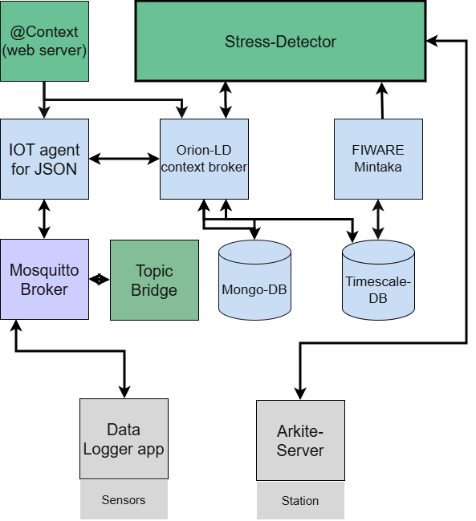

# bioSignals-LD-2

## 1. Introduction

`bioSignals-LD-2` was developed as a part of Intelligent Worker Assistance Application Area of the P2CODE Project. 

This repo represents the main application of the Use case 2 the app has the following functionalities. 

- create and initialize a trial from a simple web interface,
- provision a sensor through the FIWARE IoT Agent,
- compute time and frequency-domain features and derive stress-related states,
- trigger a complex-event-processing (CEP) workflow that publishes an updated line speed based on the stress state of the operator.

## 2. Archetecture
The application is based around key FIWARE components, namely Orion-LD, Mintaka, and IoTAgent-JSON.  
The picture below depicts the overall architecture.

<p align="center">
  
</p>

## 3. How to use the code

### Prerequisites

Before starting, make sure you have:

- Docker
- Docker Compose

### Clone the repository

```bash
git clone https://github.com/danish123117/bioSignals-LD.git
cd bioSignals-LD
```

### Configure environment variables

The repository already includes a `.env` file with the main service ports, versions, and container names.

Review it before starting, especially if you want to change:

- Orion-LD version and exposed port
- Mintaka and TimescaleDB versions
- IoT Agent ports
- application and context service ports
- MQTT broker settings

### Start the stack

The repository includes a `docker-compose.yaml` file for the complete stack. You can directly test if by running:

```bash
docker compose up -d
```
You can force local build from source using following command 

```bash
docker compose up --build -d
```

### Access the application

Once the containers are running, open:

```text
http://localhost:3002
```

### Typical workflow

1. Open the home page.
2. Enter a trial name and click **Start Trial**.
3. The application creates the trial entities and provisions the sensor.
4. Optionally enable real-time EMG updates in the UI.
5. Click **Start Anomaly detector**.
6. Click **Start CEP**.
7. When finished, click **Stop Trial**.

### What the stack is doing behind the scenes

- **Orion-LD** stores current NGSI-LD entities.
- **Mintaka + TimescaleDB** provide temporal access to historical entity data.
- **IoT Agent JSON** manages device provisioning and ingestion.
- **Mosquitto** transports MQTT messages from sensors and to the Robotic systems.
- **The Flask app** orchestrates trial creation, processing, and UI flow.

Note that the application expects the rest of the FIWARE stack (Orion-LD, IoT Agent, Mintaka, Mosquitto, context service, databases) to be available through the container network, so the full Docker Compose deployment is the recommended setup.

---

## 4. Related repositories and recommended resources

The application relies on the following components referenced in the archetecture and the docker-compose file:

- **Context server** - source code of the context service 
  `https://github.com/danish123117/INCODE-AtContextServer`
- **Topic Bridge** - republishes the MQTT topics to format supported by IoTAgent-JSON
  `https://github.com/danish123117/INCODE-MQTT_Topic_Bridge`

More information about the use of FIWARE components can be found on the following links: 

- **NGSI-LD Smart Farm Tutorials**
  `https://ngsi-ld-tutorials.readthedocs.io/en/latest/`

## 5. Sensor info

Use case uses polar H10 and sEMG sensors. A total of six sEMG sensor units and one PolarH10 were used. Intermediate Sensor logger apps were used to publish the data via MQTT to the follwing topic json/danishabbas2/hr(or ecg, acc, EMG1001)/attrs . Which follows the schema payloadFormat/apiKey/sensorID/attrs required for IoTAgent-Json. 

## 6. Acknowledgement

This work was carried out within the framework of the project **P2CODE**, funded by the **European Union** under **Grant Agreement No. 101093069**.
<p align="left">
  
</p>

## 7. Disclaimer

Views and opinions expressed are however those of the author(s) only and do not necessarily reflect those of the European Union or or the European Commission. Neither the European Union nor the European Commission can be held responsible for them.

## 8. MIT License

This project is licensed under the MIT License. See the [LICENSE](LICENSE) file for details.

